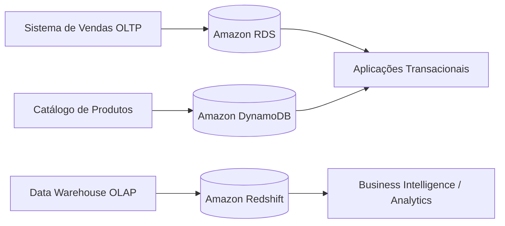
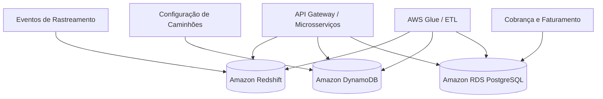

# AC3 – Modelos de Banco de Dados e Arquiteturas de Dados

**Aluno:** Renan Barbosa
**Curso:** Engenharia de Computação
**Disciplina:** Big Data & Cloud Computing
**Código:** BDCC_CDIA_26.1_8001
**Avaliação:** AC03
**Ano:** 2026

---

# Questões Objetivas

## Questão 1

### Resposta:

**c) Colunar**

### Justificativa:

Bancos de dados colunares são otimizados para workloads analíticos (OLAP), nos quais é necessário executar agregações e consultas complexas sobre grandes volumes de dados. Diferentemente dos bancos orientados a linhas, o armazenamento colunar permite leitura seletiva apenas das colunas necessárias, reduzindo operações de I/O e aumentando significativamente a performance.

Além disso, bancos colunares oferecem:

* Alta compressão de dados
* Melhor throughput analítico
* Redução de custo por consulta
* Excelente escalabilidade para Big Data

Considerando o cenário com aproximadamente 500 milhões de registros e consultas analíticas envolvendo região, categoria e período, o modelo colunar é o mais adequado arquiteturalmente.

---

## Questão 2

### Resposta:

**c) Orientado a documentos**

### Justificativa:

Aplicações modernas com requisitos dinâmicos necessitam de flexibilidade estrutural. Bancos orientados a documentos permitem *schema flexibility*, possibilitando que diferentes documentos possuam atributos distintos sem necessidade de migrations complexas.

Esse modelo oferece:

* Evolução rápida do schema
* Desenvolvimento ágil
* Escalabilidade horizontal
* Flexibilidade estrutural

No cenário apresentado, os perfis de usuários possuem atributos variáveis, tornando o modelo orientado a documentos a melhor escolha.

---

## Questão 3

### Resposta:

**c) Relacional (tabular)**

### Justificativa:

Sistemas financeiros exigem consistência forte e suporte completo às propriedades ACID (Atomicidade, Consistência, Isolamento e Durabilidade).

Bancos relacionais são os mais adequados porque oferecem:

* Integridade referencial
* Transações multi-tabela
* Controle transacional robusto
* Consistência absoluta dos dados

Operações bancárias como débito e crédito exigem atomicidade para evitar inconsistências financeiras, característica suportada nativamente por bancos relacionais.

---

## Questão 4

### Resposta:

**b) II, apenas**

### Justificativa:

* **I – Falsa:** bancos colunares armazenam dados por coluna, e não por linha.
* **II – Verdadeira:** bancos orientados a documentos utilizam esquema flexível.
* **III – Falsa:** bancos relacionais tradicionais são otimizados principalmente para workloads transacionais (OLTP), e não para analytics massivo (OLAP).

---

## Questão 5

### Resposta:

**c) Amazon Redshift**

### Justificativa:

O Amazon Redshift é um Data Warehouse colunar totalmente gerenciado pela AWS, projetado para consultas analíticas em larga escala.

Suas principais características incluem:

* Arquitetura colunar
* Processamento Massivamente Paralelo (MPP)
* Alta compressão
* Excelente performance analítica
* Integração com o ecossistema AWS

Para workloads analíticas envolvendo dezenas ou centenas de terabytes, o Redshift apresenta excelente relação entre custo e performance.

---

# Questões Discursivas

# Questão Discursiva 1 – Cenário Integrador

## Arquitetura de Dados – Cenário Integrador

---

## a) Modelo de banco de dados ideal para cada necessidade

| Necessidade              | Modelo de Banco        | Justificativa                                                |
| ------------------------ | ---------------------- | ------------------------------------------------------------ |
| Sistema de vendas (OLTP) | Relacional             | Necessita ACID, integridade referencial e consistência forte |
| Data Warehouse (OLAP)    | Colunar                | Otimizado para consultas analíticas e agregações massivas    |
| Catálogo de produtos     | Orientado a documentos | Permite flexibilidade estrutural e evolução dinâmica         |

---

## Sistema de vendas (OLTP)

O sistema transacional da empresa exige processamento consistente e confiável de milhares de operações simultâneas envolvendo estoque, vendas e clientes.

O modelo relacional é o mais adequado devido ao suporte a:

* Transações ACID
* Integridade referencial
* Controle transacional
* Consistência forte

Esse modelo é ideal para workloads OLTP, onde confiabilidade e precisão são prioritárias.

### Serviço AWS recomendado:

**Amazon RDS (PostgreSQL ou MySQL)**

### Vantagens:

* Consistência forte
* Integridade transacional
* Segurança operacional

### Desvantagens:

* Escalabilidade horizontal mais limitada
* Menor flexibilidade estrutural

---

## Data Warehouse (OLAP)

O ambiente analítico precisa processar aproximadamente 5 PB de dados históricos para consultas complexas da diretoria.

Nesse cenário, o modelo colunar é o mais eficiente porque:

* Reduz leitura desnecessária de dados
* Aumenta compressão
* Melhora throughput analítico
* Otimiza agregações massivas

### Serviço AWS recomendado:

**Amazon Redshift**

### Vantagens:

* Alta performance analítica
* Excelente compressão
* Escalabilidade para Big Data

### Desvantagens:

* Não otimizado para workloads transacionais
* Maior latência para escrita frequente

---

## Catálogo de produtos

O catálogo apresenta alta variabilidade estrutural, pois diferentes categorias possuem atributos distintos.

O modelo orientado a documentos é ideal devido ao *schema flexibility*.

### Serviço AWS recomendado:

**Amazon DynamoDB**

### Vantagens:

* Flexibilidade estrutural
* Escalabilidade horizontal
* Alto desempenho

### Desvantagens:

* JOINs limitados
* Consultas relacionais mais complexas

---

# Questão Discursiva 2 – Persistência Poliglota e Arquitetura Distribuída

## Arquitetura de Persistência Poliglota

---

## a) Arquitetura proposta

| Desafio                 | Modelo                 | Serviço AWS           |
| ----------------------- | ---------------------- | --------------------- |
| Rastreamento de eventos | Colunar                | Amazon Redshift       |
| Configurações flexíveis | Orientado a documentos | Amazon DynamoDB       |
| Cobrança e faturamento  | Relacional             | Amazon RDS PostgreSQL |

---

## b) Estratégias para reduzir a complexidade operacional

### 1. Orquestração e Integração de Dados

Ferramentas recomendadas:

* AWS Glue
* Apache Airflow
* AWS Step Functions

Essas soluções automatizam pipelines ETL/ELT e reduzem inconsistências operacionais.

---

### 2. Camada Unificada de APIs

A utilização de API Gateway e microsserviços desacopla aplicações dos bancos específicos, reduzindo dependência tecnológica direta e simplificando manutenção da arquitetura distribuída.

---

## c) Modelo inadequado para o Desafio 1

### Modelo inadequado:

**Relacional**

### Justificativa:

* Escalabilidade horizontal limitada
* Menor eficiência analítica
* Consultas lentas sobre bilhões de registros
* Alto custo operacional em workloads OLAP

Bancos relacionais são projetados prioritariamente para workloads transacionais (OLTP), enquanto o cenário apresentado exige processamento analítico massivo (OLAP), melhor atendido por arquiteturas colunares.
